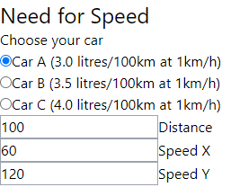

# Need for Speed

## Development mode

1. `npm install`
2. `npm start`
3. Open <http://localhost:3000/>
4. In Atom,
   press <kbd>Ctrl</kbd>+<kbd>Shift</kbd>+<kbd>P</kbd>
   and select "Chlorine: Connect Socket Repl"
   and "Chlorine: Connect Embedded"
   - Now you can evaluate code in Atom e.g. with
     [Chlorine's example keybindings](https://github.com/mauricioszabo/atom-chlorine/blob/master/README.md#keybindings)

## Building for production

1. `npm run build`

## Issues

### Number diffs are sometimes off

E.g. with distance 3500 and speeds 110 and 95:

- Fuel consumptions per 100km are 7.97 and 6.96 liters.
  The diff is shown as plus/minus 1.00 liter,
  but it should be 0.01 liters more.
- The times are 31 h 49 min and 36 h 51 min.
  The diff is shown as plus/minus 5 h 1 min,
  but it should be one minute more.

## Diary

- 1×🍅 = 1 pomodoro = ~30 minutes
- Total time spent: ?×🍅 = ~? hours

### 2021-05-24: 🍅

Set up the project.

### 2021-05-25: 🍅🍅

Got distracted looking for a nice Clojure IDE.

Previously I have used [Cursive IDE](https://cursive-ide.com/)
when doing
[Clojure exercises on Exercism](https://mtsknn.fi/weekly-log/2021/11/#clojure-exercises-on-exercism).
Cursive uses Paredit for "structural editing."
I'm sure it's very handy and useful,
but it seems too much of a hassle to set up,
especially as I'm also using IdeaVim (Vim plugin).
(Update: see [2021-05-30](#2021-05-30-).)

I think I'll try:

- [Atom](https://atom.io/) (code editor)
- vim-mode-plus (Vim plugin)
- Chlorine (Clojure REPL plugin)
- [Parinfer](https://shaunlebron.github.io/parinfer/)
  (plugin which simplifies writing and editing Lisp code like Clojure).

### 2021-05-26: 🍅🍅

Finished configuring Atom for now.
So far so good!

Also [asked about Reagent template's license file](https://github.com/reagent-project/reagent-template/issues/182).

### 2021-05-27: 🍅🍅🍅

Committed this readme file.
(I have been updating this every day.)

Removed the Reagent template's license file
by [editing the initial commit](https://stackoverflow.com/a/2309391/1079869)
and added my own license file.

Set up [Twind, a Tailwind-in-JS library](https://twind.dev/).
I first tried to install it via npm and load it in `core.cljs`:

```clj
(ns need-for-speed.core
    (:require
      [reagent.core :as r]
      [reagent.dom :as d]
      ["twind/shim"])) ;; <- Same as `import 'twind/shim'` in JS
```

But for some reason I got errors in the browser's console:

```
app.js:1551
An error occurred when loading need_for_speed.core.js

app.js:1552
TypeError: (0 , module.pathToFileURL) is not a function
    at Object.shadow$provide.module$node_modules$twind$shim$shim_cjs (:3000/js/cljs-runtime/module$node_modules$twind$shim$shim_cjs.js:3)
    at Object.shadow.js.jsRequire (:3000/js/cljs-runtime/shadow.js.js:34)
    at Object.shadow.js.require (:3000/js/cljs-runtime/shadow.js.js:59)
    at eval (:3000/js/cljs-runtime/need_for_speed.core.js:2)
    at eval (<anonymous>)
    at Object.goog.globalEval (app.js:486)
    at Object.env.evalLoad (app.js:1549)
    at app.js:1733

(index):18
Uncaught TypeError: need_for_speed.core.init_BANG_ is not a function
    at localhost/:18
```

So that's why I'm loading it via a CDN for now.

Started implementing the UI:



Beautiful. 😂

### 2021-05-28: 🍅

Started handling form elements' state in React/Reagent.

### 2021-05-29: 🍅🍅🍅🍅

Finished handling form elements' state in React/Reagent.

Created initial component for showing the calculation results.

Split code into multiple files.

### 2021-05-30: 😴

Didn't work on the project on this day.
Sundays are for sleeping and resting
(thus the sleeping emoji).

I wrote before (see 2021-05-25)
that I'd like to use Cursive IDE,
but chose Atom because Atom has a Parinfer plugin,
and Cursive only uses Paredit (built in).

But I was wrong:
[Cursive supports also Parinfer out of the box](https://mtsknn.fi/weekly-log/2021/21/#clojure-cursive-ide-supports-parinfer-out-of-the-box).
There's just no mention of Parinfer _anywhere_ in the Cursive docs. 🤦‍♂️

Anyway,
I'm going to stick with Atom in this project.
I might use Cursive for future projects
because I liked it when I used it earlier.
But I like Atom as well... 🤔

### 2021-05-31: 🍅🍅

Cleaned up code.

Started showing diffs (e.g. "-3.12 liters" or "+0.22 hours") in results.
Had trouble with using JavaScript's
[`Number.toLocaleString()`](https://developer.mozilla.org/en-US/docs/Web/JavaScript/Reference/Global_Objects/Number/toLocaleString).
Gotta continue tomorrow.

### 2021-06-01: 🍅🍅

Got number formatting working!
Not sure what was wrong yesterday
because today my code is quite much the same. 😅
Anyway, here's what's working:

```clj
(.toLocaleString 1234 "en" #js {:signDisplay "exceptZero"})
;; "+1,234"
```

### 2021-06-02: 🍅🍅

Improved number formatting
and cleaned up code.

Started formatting times,
e.g. "1.67 hours" → "1 hour 40 minutes."

### 2021-06-03: 🍅🍅

Finished formatting times
and cleaned up code.
